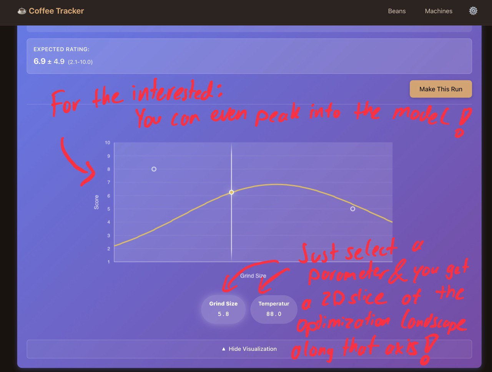

# Coffee Tracker ☕

## Are you a computer scientist who enjoys drinking coffee?

Do you find yourself optimizing everything — from your git aliases to your morning routine? Have you ever stared at your espresso machine and thought, "This needs hyperparameter tuning"?

Well, **hyperparameter optimization for neural networks is yesterday's news.** Let's use the power of **Gaussian Processes** to optimize what *really* matters: **your coffee!**

I present to you: **Your Very Personal Coffee Tracker** — a web app where you can track your beans, machines, and brewing experiments... and it comes with its own **Bayesian Optimization algorithm**! Because why guess your perfect grind size when you can let an AI suggest it based on your taste preferences?

Have fun experimenting, and try it out here: **https://linskii.github.io/coffee-tracker/**

---

## What Is This?

A beautiful, minimalist web application for tracking coffee beans, machines, and brewing runs — with an AI that learns your preferences and suggests optimal brewing parameters. Built as a Christmas present for coffee enthusiasts who want to perfect their brew using data and science.

**Key Features:**
- 🤖 **Bayesian Optimization AI** that learns from your ratings and suggests optimal brewing parameters
- ☕ **Flexible Machine Configurations** with sliders, numbers, dropdowns, and text inputs
- 🫘 **Bean Freshness Tracking** with visual indicators
- ⭐ **Smart Rating System** with one-star-per-combo favorites
- 🗑️ **Cascading Deletes** that keep your data clean
- 📱 **Offline-First** — all data stays in your browser
- 🌙 **Coffee-Themed Dark UI** that's easy on the eyes

---

## Getting Started

### Try It Now
Visit the deployed app: **https://linskii.github.io/coffee-tracker/**

Or open `index.html` directly in your browser for local use.

### Your First Brew Session

**1. Create a Coffee Machine**
- Go to "Machines" and click "Add Machine"
- Give it a name (e.g., "La Marzocco Linea Mini")
- Add parameters for your machine with different input types:
  - **Slider**: Bounded numeric values (e.g., Grind Size: 1-20, step 0.5)
  - **Number**: Unbounded numbers (e.g., Temperature: 92°C, Dose: 18g)
  - **Dropdown**: Categorical choices (e.g., Roast Level: Light/Medium/Dark)
  - **Text**: Free-form notes (e.g., Brew Method notes)
- **Tip**: Use the provided templates for Espresso Machine, Pour Over, or French Press to get started quickly!

**2. Add Your Coffee Beans**
- Go to "Beans" and click "Add Bean"
- Enter the bean name, purchase date, and optional tasting notes
- The app will show freshness indicators:
  - 🟢 Fresh (0-14 days)
  - 🟡 Good (15-30 days)
  - 🟠 Aging (31-60 days)
  - 🔴 Old (60+ days)

**3. Record Your Brews**
- Select a bean, then select a machine for that bean
- Click "New Run" to record a brewing session
- Enter values for all your machine's parameters
- **Rate your brew from 1-10** (required) — this is what the AI learns from!
- Add optional notes about the taste
- Star it if it's your favorite for that bean-machine combo (only one can be starred at a time)

**4. Let the AI Help You**
- After **5 rated runs** (configurable in Settings), the **AI Suggestion Card** appears!
- The AI uses Gaussian Processes to analyze your ratings and parameter combinations
- It suggests optimal parameters that balance:
  - **Exploitation**: Refining what's already working well
  - **Exploration**: Trying new areas that might be even better
- Click **"Make This Run"** to pre-fill the run form with AI-suggested values
- Try it, rate it, and watch the AI improve its suggestions over time!

---

## How the AI Works (The Fun Part!)

The Bayesian Optimization engine is the crown jewel of this app. Here's what it does:

### What Gets Optimized?
- **Slider parameters**: Normalized to [0,1] range
- **Number parameters**: Normalized using historical min/max with 20% padding
- **Dropdown parameters**: Ordinally encoded (first option = 0, second = 1, etc.)
- **Text parameters**: Excluded (not optimizable)

### The Process
1. **Data Collection**: Every rated run becomes a training observation
2. **Gaussian Process Training**: The AI builds a probabilistic model of how parameters affect your ratings
3. **Smart Suggestions**: Using the UCB (Upper Confidence Bound) acquisition function, it evaluates 100 random parameter combinations and picks the most promising one
4. **Continuous Learning**: Each new rated run updates the model, making suggestions smarter over time

### Configuration Options
In **Settings**, you can tweak:
- **Minimum runs threshold** (default: 5) — how many runs before AI activates
- **Exploration factor** (default: 2.0) — higher values = more adventurous suggestions
- **Number of candidates** (default: 100) — how many combinations to evaluate
- **GP hyperparameters** — kernel length scale, output scale, noise (for the brave!)

### No Data? No Problem!
- If you have fewer than the minimum runs, the AI card appears blurred with "Needs more data (3/5 runs collected)"
- You can still click **"Show Anyway"** to peek at suggestions (though they'll be less reliable)

### 📈 Interactive Visualization

The AI doesn't just give you numbers — it shows you *why* it made its suggestion!



**Features:**
- **2D Gaussian Process Curves**: See the AI's model of how each parameter affects your rating
- **Interactive Parameter Selection**: Click any parameter button to visualize its optimization landscape
- **Confidence Intervals**: The shaded area shows the AI's uncertainty (wider = needs more data)
- **Your Past Brews**: Hollow circles show where you've already experimented
- **AI Suggestion**: The yellow highlight shows where the AI thinks you should try next
- **Expected Rating**: See the predicted rating and confidence range for the suggestion

The visualization helps you understand:
- Which parameters have the biggest impact on your coffee quality
- Where you have data gaps that need exploring
- How confident the AI is about different parameter ranges
- Why the AI chose specific values for its suggestion

**Pro tip**: For the interested, you can peek into the model by selecting a parameter and dragging your finger left and right to explore the optimization landscape along that axis!

---

## Key Features Explained

### 🔧 Machine Management
- Create unlimited custom machines
- Mix and match parameter types (sliders, numbers, dropdowns, text) on the same machine
- Edit machines anytime — **note**: editing parameters will clear that machine's AI optimization data to prevent inconsistencies
- Delete machines with automatic cleanup of all associated runs

### 🫘 Bean Tracking
- Track unlimited beans with purchase dates and notes
- Visual freshness indicators help you prioritize which beans to use
- Delete beans with automatic cleanup of all associated runs

### 📊 Brewing Runs
- Each run records all machine parameter values, your rating (1-10), and optional notes
- Runs are organized by bean-machine combinations
- Color-coded ratings:
  - 🔴 Low (1-3)
  - 🟠 Medium (4-6)
  - 🟡 High (7-8)
  - 🟢 Excellent (9-10)
- **Star your favorite** — only one run can be starred per bean-machine combo
- Edit or delete runs anytime

### 🗑️ Cascading Deletes (Smart Cleanup!)
This app is smart about data cleanup:
- **Delete a Bean**: Automatically deletes ALL runs for that bean across all machines
- **Delete a Machine**: Automatically deletes ALL runs for that machine across all beans
- **Delete a Run**: Individual run deletion
- All deletes show confirmation dialogs telling you exactly what will be removed
- AI optimization data is automatically cleared or rebuilt when related data changes

### ⚙️ Settings
- **Language**: Switch between English and German (full i18n support)
- **AI Configuration**: Adjust minimum runs threshold, exploration factor, and more
- **Export/Import**: Backup your data or transfer it to another browser

---

## Use Cases

- **Espresso Dialing**: Find the perfect grind size, dose, temperature, and pressure for each bean
- **Pour Over Perfection**: Optimize bloom time, water temperature, and coffee-to-water ratio
- **French Press Experiments**: Track steep times and grind sizes for different beans
- **Multi-Machine Comparison**: See which machine works best with which beans
- **Bean Freshness Optimization**: Track how ratings change as beans age

---

## Tech Stack (For the Curious)

This is a **zero-dependency, vanilla JavaScript** project:
- **No frameworks** (React, Vue, Angular)
- **No build tools** (Webpack, Vite, Rollup)
- **No external libraries** — the entire Gaussian Process implementation (~630 lines) is custom-built!
- **Pure HTML5/CSS3/JavaScript (ES6+)**
- **localStorage** for client-side persistence
- **Hash-based SPA routing** for smooth navigation
- **GitHub Pages** for free static hosting

### Architecture
```
UI Layer (Views, Components, Router)
    ↓
State Management (Observable Pattern)
    ↓
Repository Layer (CRUD Operations)
    ↓
Data Models (Validation, Factory Functions)
    ↓
Storage Layer (localStorage Wrapper)

Bayesian Optimization Module (Parallel):
Kernels → Gaussian Process → Acquisition Functions → BO Service
```

---

## Development

No build step required! The app uses vanilla JavaScript with no dependencies.

### Local Development Server

```bash
npm run dev
```

This starts a local server at `http://localhost:8000`. Open this URL in your browser to view the app.

### Manual Deployment

To deploy to GitHub Pages:

```bash
npm run deploy
```

This creates a clean `gh-pages` branch and deploys your static files.

**Note**: The GitHub Actions workflow automatically deploys to GitHub Pages on every push to `main`, so manual deployment is usually not needed.

### Without npm

You can also just open `index.html` directly in your browser, or use any static server:
```bash
python3 -m http.server 8000
# or
npx serve
```

---

## Limitations

- **Data stored in browser**: Limited to ~5-10MB by localStorage (plenty for thousands of runs)
- **No cloud sync**: Data lives only in your browser (use export/import to transfer)
- **No account system**: This is a personal offline-first tool
- **AI requires data**: Needs at least 5 rated runs before suggestions become reliable

---

## FAQ

**Q: Will the AI really make my coffee better?**
A: If you consistently rate your brews and follow the suggestions, the AI will converge toward parameter combinations that maximize *your* personal ratings. So yes — but only if you're honest with your ratings!

**Q: Can I use this without the AI?**
A: Absolutely! It's a fully functional coffee tracker even without the optimization. The AI is just a fun bonus.

**Q: What if I delete a machine after collecting runs?**
A: All runs for that machine will be deleted automatically (with a confirmation dialog). The app prevents orphaned data.

**Q: Can I export my data?**
A: Yes! Go to Settings → Export Data to download a JSON file of all your machines, beans, and runs.

**Q: Does this work offline?**
A: Yes! All data is stored locally. No internet required after the initial page load.

**Q: Why did you build this?**
A: Because optimizing coffee with Gaussian Processes is way more fun than just drinking it. Also, it was a Christmas present. 🎄

---

## License

Personal project created as a gift. Feel free to fork and modify!

---

**Built with ❤️, ☕, and a healthy obsession with optimization**

*P.S. — If you find a bug, it's not a bug, it's a feature request for your next brewing experiment.*
